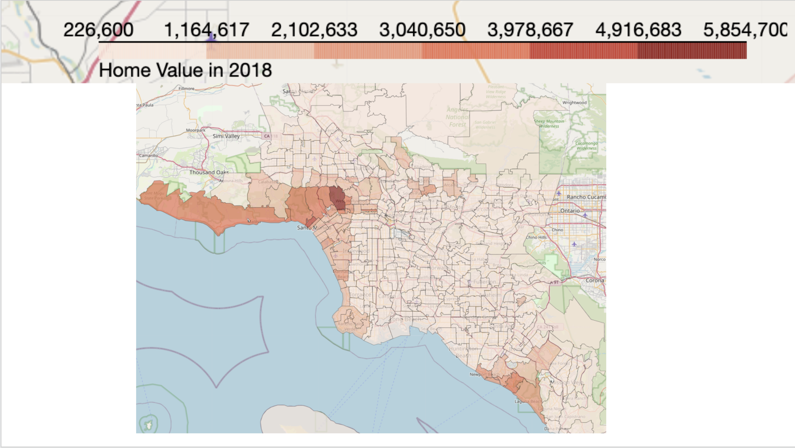
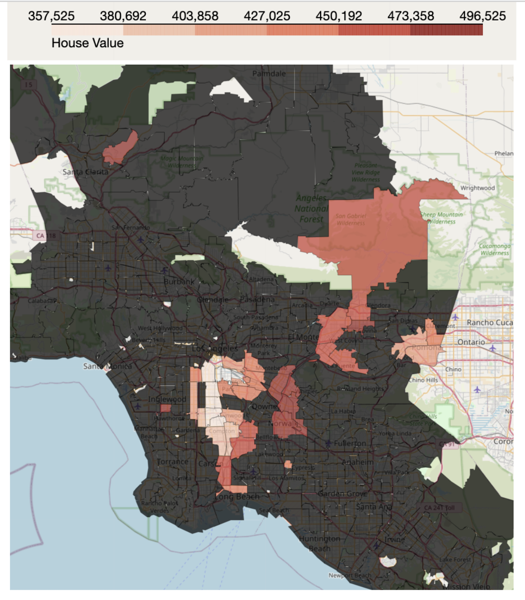
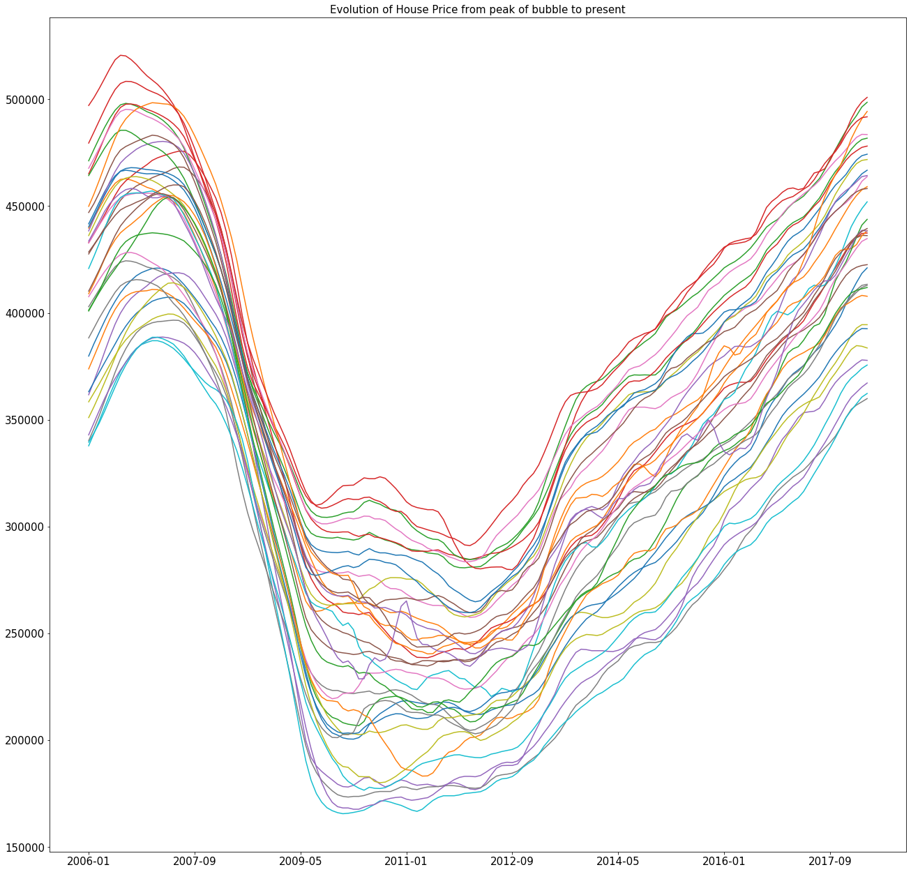
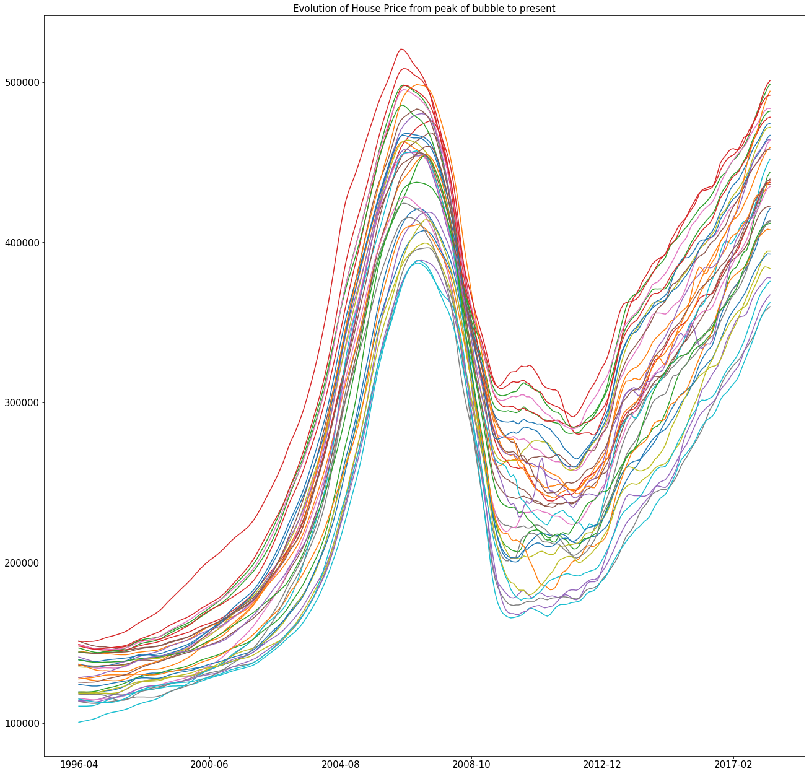
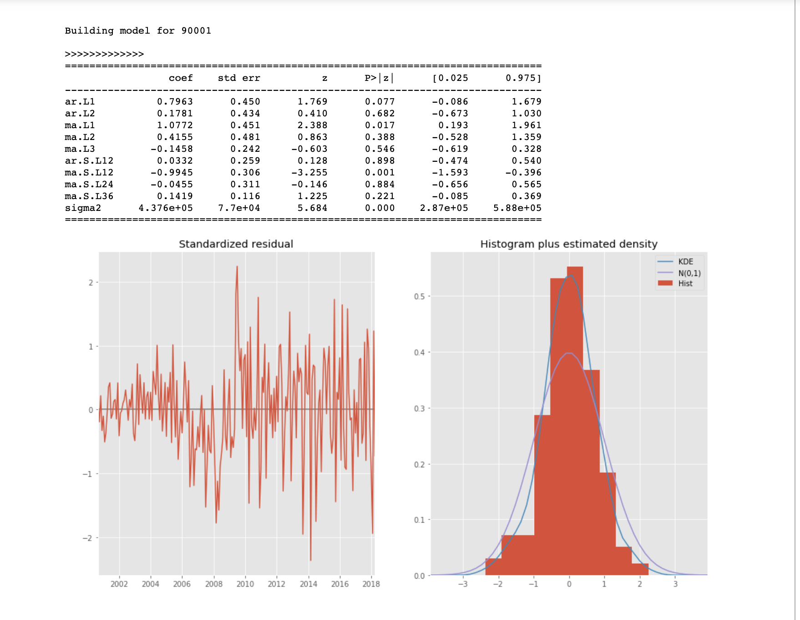
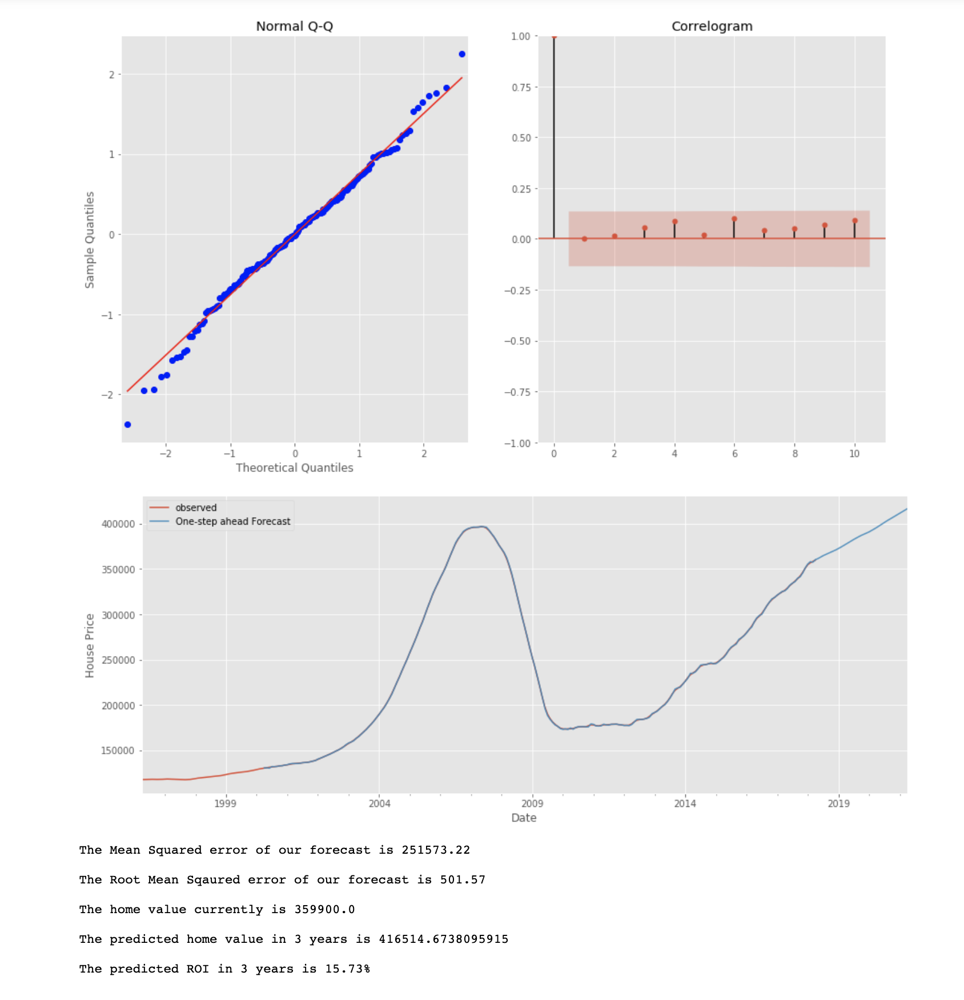

# Time Series Forecasting


<h2>Purpose</h2>
The purpose of this repo is to identify the top 5 Zip Codes to invest in in the LA metro area, using 3 year ROI as the measurement for "Best"

<h2>Data Description</h2>
The Repo is split up into 5 folders 

```

Data:
* clean_data_la.csv
* county_annual_la.csv
* county_la.csv
* model_data_4.csv
* timeseriesdata.csv
* zillow_data.csv
* zipcity_la.csv
* zipcode_la.csv
* Zicodes_annual_la.csv
* Zipcodes_monthly_la.csv
* Zipcodes.csv

Notebooks:
* Cleaning_LA.ipynb
* Final_Model_5_Zipcodes.ipynb
* Maps=Fianl.ipynb

GeoJsons:
Multiple Geojsons

Images:
* Contains array of images that are use in the powerpoint pdf

Maps:
* Contains array of maps
```

<h2> The project follows the CRISP-DM Process <h2>

<h2> Business Understanding </h2>
What are the top 5 best zip codes for us to invest in? Client has $5,000,000 to invest across different Zip Codes


<h2> Data Understanding </h2>
Full EDA was performed on the dataset to further understand the problem and to explore different factors that zip codes in the Los Angeles-Long Beach-Anaheim Metropolitan Area.

<h4>House Prices in the Chosen Zip Codes as at April 2018</h4>
The median list price per Zip Code varies hugely. In the areas of Malibu, Santamonica etc house prices can reach up to 5.8 million. This is in stark contrast to other Zip codes where the average home price is closer to 200,000$

<br>
 <br>
 

<br>  <br>
<h4>Deliverables - Criteria for choosing Zip Codes</h4>
<ol>
<li>Home Value below $500,000


<li>No more than +/- $20,000 from the peak 2006 prices</li>
 <ul> Want homes Zip Codes that have just reached back to 2006 peak levels</ul>

<li>10% 3 year Return on Investment</li>
 <ul> ROI for past 3 years >10%</ul>
</ol>




<br>   <br>
<h4>Evolution of the House Prices in chosen Zip Codes</h4>
 
 


<h2> Data Preparation</h2>
Columns were dropped and turned into time series format for modelling

<h2> Modelling </h2>
Optimal Parameters were found using itertools:

d = (1,2)
p = q = (1,2,3)

A SARIMAX model was then used on each of the 36 Zip Codes, to predict house prices in 3 years time.

Top 5 Zip Codes were chosen based on the highest 3 year ROI based on these models.

The Top Zip Codes are as follows:
* 90037: 3-year ROI = 20.35%
* 90304: 3-year ROI = 17.79%
* 90813: 3-year ROI = 14.99%
* 90001: 3-year ROI = 10.56%
* 91768: 3-year ROI = 4.96%





<h2>Future Work</h2>
<ol>
<li>More Data - Gather more information about House Prices in Zip Codes
    <ul> More up to date - 2020 </ul>
    <ul> Explore schools, hospitals etc in Zipcodes - Does School cachement area affect prices</ul>
    <ul> Demographic information - Age, Families etc per Zip Code</ul>
    </li>

